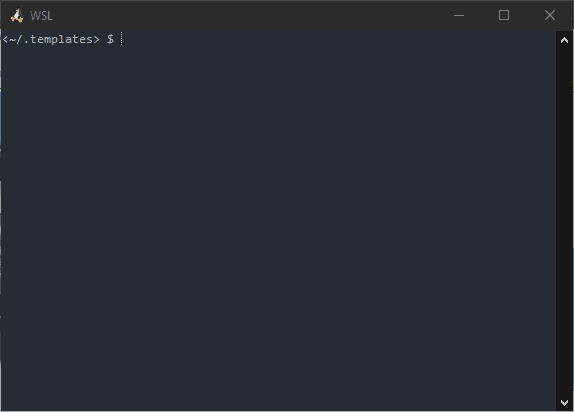

# project-templates.nvim

This plugin allows to manage projects templates using easily from nvim command-line.

With some extra features:
- File names can contain tokens
- Directory tree can contain tokens
- __TODO__ Migrated to lua
- __TODO__ Remove python dependency(?)

## Demo

# Usage  
- `:LoadTemplate` - Load a template into a new project. The plugin will look for placeholders (e.g. `#{PLACEHOLDER}`), and ask for values to replace them in each non-binary file
- `:DeleteTemplate` - Delete a template
- `:SaveAsTemplate` - Save the current folder and all files and subfolders as a new template

The plugin will look for templates in `~/.templates`. Sample templates can be found at [Carlosmape/project-template-samples](https://github.com/Carlosmape/project-template-samples). If you want to create your own templates, simply create a new project, add the placeholders you want, and save it manually in `~/.templates`, or use the `:SaveAsTemplate` command.

# Quick Start
## Requirements
You will need neovim compiled with python3 support. To determine whether or not your neovim has python support, type `:echo has('python3')` and press enter. If it outputs `1`, you have python3 support, otherwise you will need to run the command `pip install pynvim`.

You will also need to run the command `pip install binaryornot`.

## Installation
Add this to your init.vim:

- Packer:
  - `use 'Carlosmape/project-templates.nvim'`

- vim-plug:
  - `Plug 'Carlosmape/project-templates.nvim', { 'do': ':UpdateRemotePlugins' }`
 
- Vundle:
  - `Plugin 'Carlosmape/project-templates.nvim', { 'do':  ':UpdateRemotePlugins'}`

Then run `:PackerInstall` (Packer), `:PlugInstall` (vim-plug) or `:PluginInstall` (Vundle) or whatever plugin manager you use command to install new plugins.

Finally, restart Neovim.

# Credits
Original repository  [pianocomposer321/project-templates.nvim](https://github.com/pianocomposer321/project-templates.nvim) 
